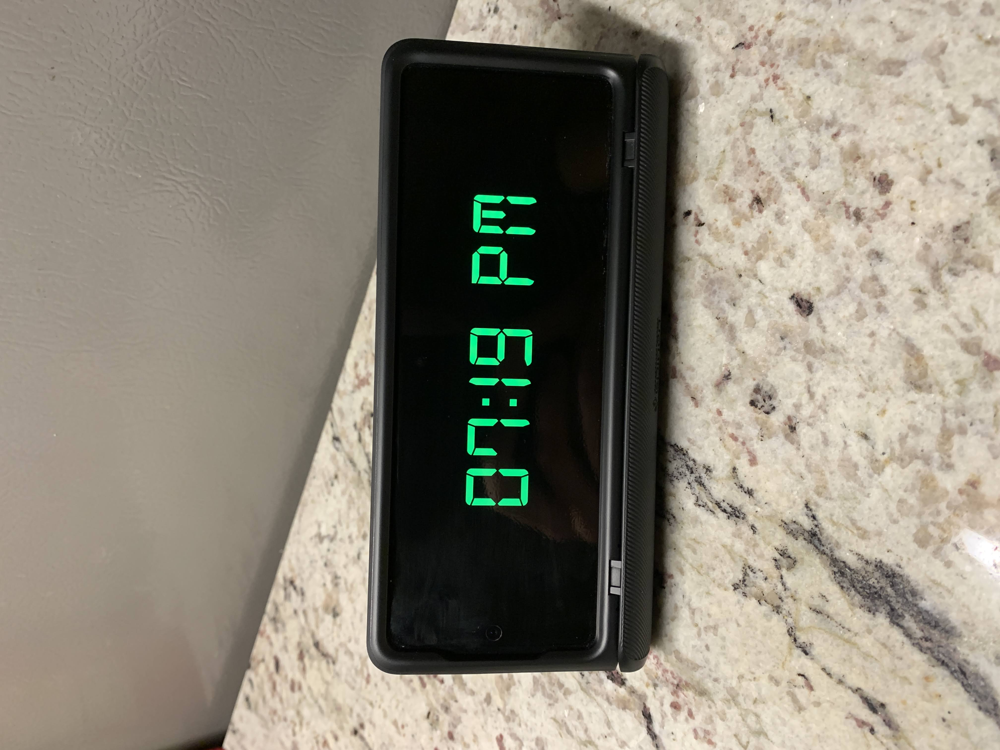
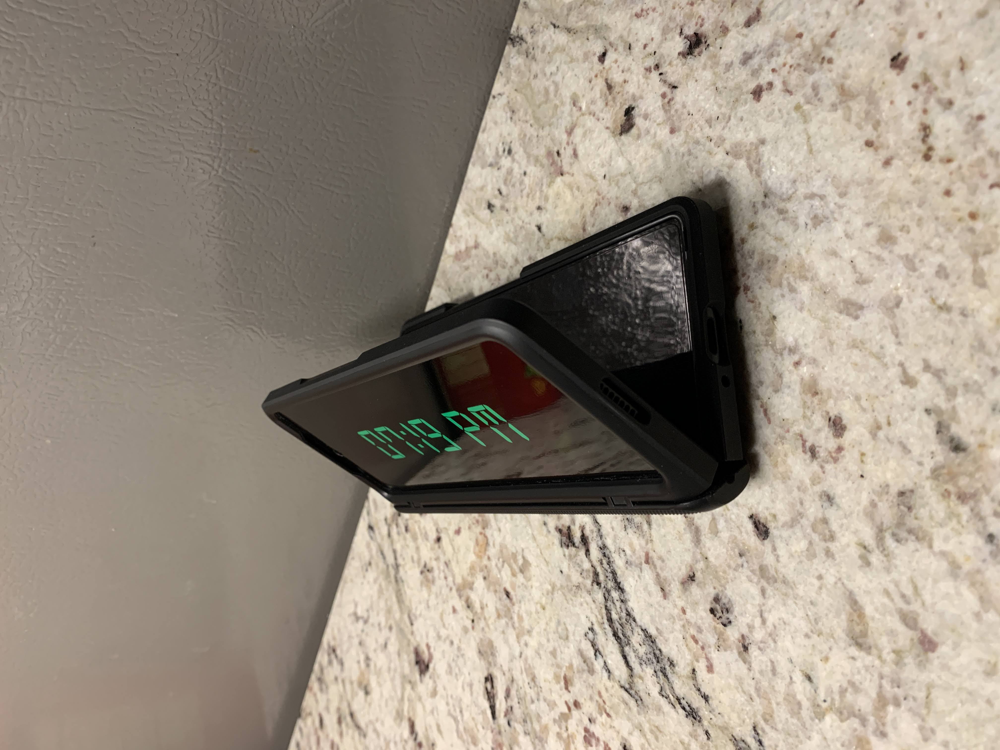
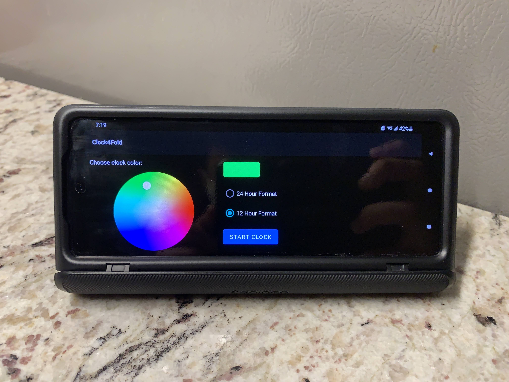
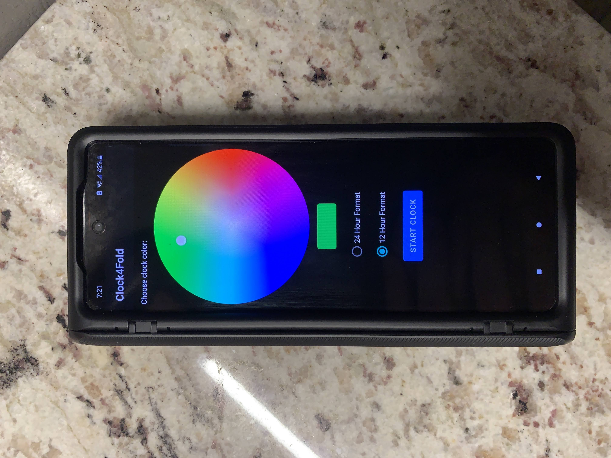

# Clock4Fold

A simple clock app for the Galaxy Z Fold 2.

Features:
- Change clock color
- Choose time format
- The app will flash a black screen every ~4 minutes to prevent screen burn in.

\*Has only been tested for the Z Fold 2*

Usage:
- Launch the app on the outer display and simply unfold your phone slightly like in the photos below.
- *Recommended:* Leave your phone to charge on a wireless charger!
- (The app will work on the unfolded screen, but obviously that's not the intended use case.)

This app uses the font called "Digital-7 Font Family" by Style-7 which can be accessed at https://www.1001fonts.com/digital-7-font.html#license

This app also uses a Color Picker library by skydoves which can be accessed at https://github.com/skydoves/ColorPickerView
